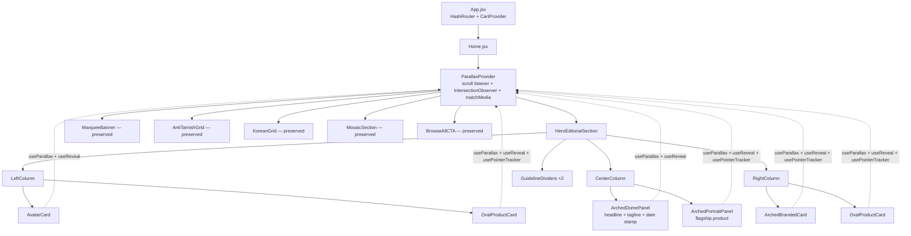
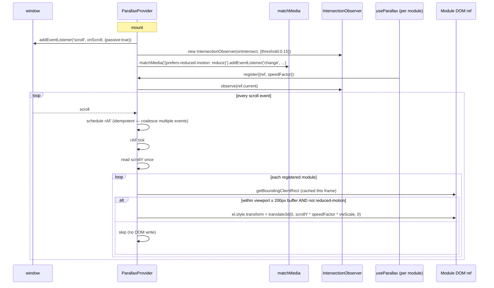

# Design Document

## Overview

This design revamps the Kaashvi Jewels homepage (`src/pages/Home.jsx`) into a luxury editorial three-column arched-panel composition with module-level parallax, reveal-on-scroll, and pointer-tracking micro-interactions. The brand's pink/rose-gold palette is retained — only the structural composition of the reference image is borrowed, never its dark-teal hues.

The implementation uses **native browser APIs only** — `IntersectionObserver`, `matchMedia`, `requestAnimationFrame`, CSS transitions, and CSS custom properties — packaged behind four small React hooks (`useReducedMotion`, `useParallax`, `useReveal`, `usePointerTracker`). A single `ParallaxProvider` context owns the lone scroll listener and the lone `IntersectionObserver` for the entire homepage, satisfying the performance budget (one passive listener, one observer) and adding **zero KB of third-party JavaScript**.

Scope is strictly the homepage: `src/pages/Home.jsx` is rewritten, `src/pages/Home.css` is added, and four hook files are added under `src/hooks/`. The Navbar, Footer, CartContext, products data, asset helper, routing, and every other page remain untouched.

### Key Design Decisions

| Decision | Choice | Rationale |
|---|---|---|
| Animation strategy | Native CSS + custom hooks | 0 KB JS overhead vs ~50 KB for Framer Motion / ~40 KB for GSAP+ScrollTrigger. All behavioral requirements (R3–R6) are satisfiable with `IntersectionObserver`, `matchMedia`, and `requestAnimationFrame`. |
| Listener architecture | One `ParallaxProvider` context at Home root | R10.2 and R10.3 mandate a single shared scroll listener and a single shared `IntersectionObserver`. Module hooks register through context. |
| Arched-panel technique | CSS `border-radius: 50% 50% 0 0 / 35% 35% 0 0` | No SVG mask required; rasterizes cleanly on every browser; preserves hit-testing for child links; cheaper to composite than `clip-path` with masks. |
| Oval card shape | CSS `border-radius: 50% / 60%` | Matches the reference image's vertical-oval product cards without an extra wrapper element. |
| Reduced-motion | `useReducedMotion` hook with live `matchMedia` change listener; consumed by every other hook | Single source of truth; satisfies R6.4 (sub-1s response to preference change). |
| Error resilience | Each hook initializes inside try/catch; on failure the module renders in its static, fully-visible state | R6.6 — the rest of the page must remain usable even if a hook throws. |
| Speed factor clamping | Pure helper `clampSpeed(s) = max(-0.6, min(0.6, s))` invoked at registration time | R3.4 — speed factor must always be in [-0.6, 0.6]. Centralizing the clamp makes the invariant statically checkable. |
| Mobile speed scaling | Pure helper `scaleSpeedForViewport(s, vw)` halves the speed factor when `vw < 640` | R7.4 — small screens reduce parallax disorientation. |
| Bestseller / New strip handling | Conditionally render only when the product list is non-empty | R9.5 / R9.6 — never render an empty container. |

## Architecture

### Component Hierarchy



### Data Flow



### File Organization

```
src/
├── pages/
│   ├── Home.jsx                  ← rewritten (this feature)
│   └── Home.css                  ← new (this feature, imported by Home.jsx)
├── hooks/                        ← new directory (this feature)
│   ├── parallaxMath.js           ← pure functions: clampSpeed, computeOffset, isInViewportBuffer, scaleSpeedForViewport, computePointerOffset
│   ├── useReducedMotion.js       ← matchMedia hook with live updates
│   ├── ParallaxProvider.jsx      ← context + scroll listener + IntersectionObserver
│   ├── useParallax.js            ← per-module parallax registration
│   ├── useReveal.js              ← per-module reveal observer registration
│   └── usePointerTracker.js      ← per-module pointer offset hook
└── (everything else unchanged)
```

`Home.css` is imported only by `Home.jsx`, so its rules are scoped to homepage classes (`.hero-editorial`, `.oval-card`, `.arched-panel`, `.guideline-divider`, etc.) and never leak into other pages.

### Hook Responsibility Boundaries

| Hook | Owns | Returns | Failure mode |
|---|---|---|---|
| `useReducedMotion` | One `MediaQueryList` + change listener | `boolean` | On `matchMedia` failure → returns `false` (motion enabled) so layout still works; the per-module hooks then independently degrade. |
| `ParallaxProvider` | One `scroll` listener, one `IntersectionObserver`, the registry of modules | Context value with `register/unregister` for parallax + reveal + a reduced-motion flag | On listener registration failure → context still mounts; modules fall back to static state. |
| `useParallax(speedFactor)` | A `ref`; registers with provider | `{ ref }` (style mutated directly on the element by provider for fewer re-renders) | On registration failure → returns inert ref, module stays at zero offset. |
| `useReveal(threshold?)` | A `ref`; registers with provider | `{ ref, isVisible }` | On registration failure → `isVisible` immediately `true` so content is not hidden. |
| `usePointerTracker(maxOffsetPx?)` | A `ref`; attaches `pointermove`/`pointerleave` to its element | `{ ref, style }` | On reduced-motion or coarse pointer or attach failure → returns inert ref + identity style. |

The provider — not the per-module hook — performs the actual `style.transform` write each frame. This means a module re-rendering does **not** force a re-write, and the provider's rAF tick is the only path that touches `transform`, eliminating layout-thrash races.

## Components and Interfaces

### `parallaxMath.js` — Pure Functions (no React)

```js
// Clamp a speed factor to the valid range. R3.4
export function clampSpeed(s) {
  if (Number.isNaN(s) || s == null) return 0;
  return Math.max(-0.6, Math.min(0.6, s));
}

// Halve the speed factor on small viewports. R7.4
export function scaleSpeedForViewport(speed, viewportWidth) {
  if (!Number.isFinite(viewportWidth) || viewportWidth <= 0) return speed;
  return viewportWidth < 640 ? speed * 0.5 : speed;
}

// Compute the parallax translate offset in CSS px for a given scroll position.
// Pure, deterministic, side-effect-free. R3.1, R3.6
export function computeParallaxOffset(scrollY, speedFactor, viewportWidth) {
  const clamped = clampSpeed(speedFactor);
  const scaled = scaleSpeedForViewport(clamped, viewportWidth);
  return scrollY * scaled;
}

// True if the bounding rect overlaps the viewport expanded by 200px in either direction. R3.5
export function isInViewportBuffer(rectTop, rectBottom, viewportHeight, buffer = 200) {
  return rectBottom > -buffer && rectTop < viewportHeight + buffer;
}

// Normalize cursor position to a [-maxOffset, +maxOffset] translate. R5.2
export function computePointerOffset(cursorX, cursorY, rect, maxOffsetPx) {
  if (rect.width <= 0 || rect.height <= 0) return { x: 0, y: 0 };
  const cx = rect.left + rect.width / 2;
  const cy = rect.top + rect.height / 2;
  const nx = (cursorX - cx) / (rect.width / 2);   // -1..+1 within bounds
  const ny = (cursorY - cy) / (rect.height / 2);
  // clamp to [-1,+1] in case the pointer is just outside the rect
  const cnx = Math.max(-1, Math.min(1, nx));
  const cny = Math.max(-1, Math.min(1, ny));
  return { x: cnx * maxOffsetPx, y: cny * maxOffsetPx };
}
```

### `useReducedMotion.js`

```js
// Returns the current value of `(prefers-reduced-motion: reduce)`,
// updates within 1s when the user changes the system preference. R6.4
export function useReducedMotion(): boolean
```

Implementation: `useSyncExternalStore` over `matchMedia('(prefers-reduced-motion: reduce)')`. Wraps the subscribe/getSnapshot calls in try/catch — on failure (e.g. `matchMedia` undefined in a test environment) returns `false`.

### `ParallaxProvider.jsx`

```jsx
<ParallaxProvider>{children}</ParallaxProvider>
```

Context value:
```ts
{
  reducedMotion: boolean,
  registerParallax: (el: HTMLElement, speedFactor: number) => () => void,  // returns unregister
  registerReveal: (el: HTMLElement, threshold: number, onReveal: () => void) => () => void,
}
```

Behavior:
1. On mount, attaches one passive `scroll` listener on `window` and one `IntersectionObserver` (threshold 0.15).
2. Each `scroll` event schedules an rAF if one isn't already pending. Inside the rAF: read `scrollY` once, then iterate the registered modules; for each module read `getBoundingClientRect` once and decide whether to write a transform.
3. If `reducedMotion === true`, the rAF tick still runs but every module's effective speed becomes 0 (no transform writes, but already-written transforms are reset to identity once on the transition).
4. The `IntersectionObserver` callback fires `onReveal` for the intersecting module and unobserves it (R4.3).
5. All listener and observer setup is wrapped in try/catch — on failure, the provider renders children with `reducedMotion: true` so modules show in their static state (R6.6).

### `useParallax(speedFactor, opts?)`

```ts
function useParallax(
  speedFactor: number,
  opts?: { mobileScale?: boolean }   // default true
): { ref: RefCallback<HTMLElement> }
```

The hook calls `registerParallax` once a ref is attached and unregisters on unmount or speed change. The provider, not the hook, mutates `style.transform`.

### `useReveal(threshold = 0.15)`

```ts
function useReveal(threshold?: number): { ref: RefCallback<HTMLElement>, isVisible: boolean }
```

`isVisible` starts `false` (or `true` when `reducedMotion` so static state shows immediately — R6.3). Once the observer fires, it sets `isVisible = true` and the provider unobserves the element. The CSS transition on the `is-visible` class produces the fade/translate (R4.4).

### `usePointerTracker(maxOffsetPx = 8)`

```ts
function usePointerTracker(
  maxOffsetPx?: number
): { ref: RefCallback<HTMLElement>, style: { transform: string, transition: string } }
```

On the element, attaches `pointermove` and `pointerleave`. Each `pointermove` schedules an rAF (idempotent per element) that reads the cursor position, calls `computePointerOffset`, and updates the returned style via a small internal `useState`. On `pointerleave` it transitions back to `translate(0,0)` over 300–500ms (R5.3).

Disabled (returns identity style and skips listeners) when:
- `useReducedMotion()` is true, or
- `matchMedia('(pointer: coarse)').matches` is true (R5.5)

These two checks are evaluated once on mount and re-evaluated on `matchMedia` change events (sub-1s response).

### Section Components on Home

```jsx
<ParallaxProvider>
  <HeroEditorialSection products={heroSelection} />     {/* new */}
  <MarqueeBanner />                                      {/* preserved markup */}
  <AntiTarnishGrid products={antiTarnish.slice(0,8)} />  {/* preserved */}
  <WideBanner featured={featuredAt11} />                 {/* preserved */}
  {bestsellers.length > 0 && <Strip title="Bestsellers" items={bestsellers} />}  {/* R9.6 */}
  {newArrivals.length > 0 && <Strip title="New Arrivals" items={newArrivals} />} {/* R9.6 */}
  <KoreanGrid products={korean.slice(0,8)} />            {/* preserved */}
  <MosaicSection products={mosaicProducts} />            {/* preserved */}
  <BrowseAllCTA />                                       {/* preserved */}
</ParallaxProvider>
```

The retained sections receive a single shared `useReveal` per top-level section (no per-card reveal observer to keep the IO callback list short).

### Hero_Editorial_Section Module Specs

| Module | Speed factor | Pointer tracker | CSS shape | Speed direction rationale |
|---|---|---|---|---|
| Left avatar card | -0.15 | no | circle (`border-radius: 50%`) | drifts up slowly — anchors the column |
| Left oval product card | +0.25 | yes | oval (`border-radius: 50% / 60%`) | drifts down — counter-motion to avatar above |
| Center arched dome (headline) | -0.05 | no | arched-top (`border-radius: 50% 50% 0 0 / 35% 35% 0 0`) | nearly stationary — keeps the headline readable |
| Center arched portrait panel | +0.10 | yes | arched-top | gentle downward drift inside the headline frame |
| Right arched branded card | -0.20 | yes | arched-top | mirrors the left avatar's negative drift |
| Right oval product card | +0.30 | yes | oval (`border-radius: 50% / 60%`) | the boldest positive drift, balancing the composition |

Speed factors satisfy R3.3 (four+ distinct values among adjacent modules) and R3.4 (all in [-0.6, 0.6]). Adjacent columns use opposing signs so the page feels layered without disorienting.

### Guideline Dividers (R1.6, R13.4)

Two thin (1px solid `var(--color-border)`) vertical dividers between columns at `≥1024px`. Implemented as pseudo-elements on `.hero-editorial__column` (`::after`) so they require zero extra DOM nodes and disappear automatically below the breakpoint.

### Decorative Date Stamp (R13.3)

A small flex block under the right column with the structure:

```html
<div class="date-stamp">
  <span class="date-stamp__num">12.01</span>
  <span class="date-stamp__divider" aria-hidden="true"></span>
  <span class="date-stamp__name">KAASHVI · ISSUE 01</span>
</div>
```

`.date-stamp__num` uses `var(--font-heading)` (Playfair Display); `.date-stamp__name` is uppercase with `letter-spacing: 0.18em` (R13.2).

### Editorial Headline (R13.1, R13.2)

```html
<div class="dome">
  <span class="dome__tagline">PRECIOUS · SS25</span>
  <h1 class="dome__headline">Jewelry Reimagined</h1>
  <span class="dome__divider" aria-hidden="true"></span>
</div>
```

`.dome__headline` is `font-family: var(--font-heading)`, `font-size: clamp(2.25rem, 5vw, 4.5rem)` — within the 3rem–5rem band at desktop (R13.1).

## Data Models

### Hero Product Selection

The Hero_Editorial_Section embeds five product slots. Selection is computed at render time from `products` in `src/data/products.js` using a deterministic, defensive lookup helper:

```js
function pickById(products, id, fallback) {
  return products.find(p => p.id === id) || fallback;
}

function selectHeroProducts(products) {
  const antiTarnish = products.filter(p => p.category === 'anti-tarnish');
  const korean = products.filter(p => p.category === 'korean');
  return {
    leftAvatar: pickById(products, 'at-01', antiTarnish[0]),         // Golden Jasmine Petal Studs
    leftOval:   pickById(products, 'kr-03', korean[0]),              // Crystal Cherry Blossom (Bestseller)
    centerHero: pickById(products, 'at-05', antiTarnish[0]),         // Golden Cascading Flower (Bestseller)
    rightCard:  pickById(products, 'at-11', antiTarnish[1] || antiTarnish[0]), // Double Butterfly (Bestseller)
    rightOval:  pickById(products, 'kr-06', korean[1] || korean[0]), // Pearl Cluster Square (Bestseller)
  };
}
```

This satisfies R9.1 (≥1 anti-tarnish + ≥1 korean), R9.2 (oval cards link to `/product/{id}`), and degrades gracefully if the chosen IDs ever go missing.

### Module Registration Records (in-memory, ParallaxProvider)

```ts
type ParallaxRecord = {
  el: HTMLElement;
  speedFactor: number;       // already clamped at registration
};

type RevealRecord = {
  el: HTMLElement;
  onReveal: () => void;
};
```

Stored as `Map<HTMLElement, Record>` so registration/unregistration is O(1) and iteration order is insertion order.

### CSS Custom Properties Added to `:root` (only if not already present)

| Token | Value | Purpose |
|---|---|---|
| `--ease-editorial` | `cubic-bezier(0.22, 1, 0.36, 1)` | R4.4 |
| `--reveal-duration` | `750ms` | R4.4 |
| `--arch-radius` | `50% 50% 0 0 / 35% 35% 0 0` | shared shape token |
| `--oval-radius` | `50% / 60%` | shared shape token |

Per R2.6, these go into `:root` in `src/App.css`; nothing is hardcoded in component CSS.


## Correctness Properties

*A property is a characteristic or behavior that should hold true across all valid executions of a system — essentially, a formal statement about what the system should do. Properties serve as the bridge between human-readable specifications and machine-verifiable correctness guarantees.*

This feature is well-suited to property-based testing: the parallax math, the pointer-offset math, the speed-scaling helper, the engine's lifecycle behavior, the reveal observer, and the homepage's structural and accessibility invariants are all universal across input — varying scroll positions, viewport widths, cursor coordinates, product counts, and DOM mutation orders cheaply exposes edge-case bugs (sign flips, off-by-one buffer checks, listener leaks, accidental re-renders) that hand-picked examples would miss.

### Property 1: Parallax math correctness

*For any* `scrollY` (finite real number including 0 and negatives), `speedFactor` (any number including `NaN`/`Infinity`/`null`), and `viewportWidth` (positive number), `computeParallaxOffset(scrollY, speedFactor, viewportWidth)` SHALL satisfy: (a) `clampSpeed(speedFactor)` lies in `[-0.6, 0.6]`; (b) the result is linear in `scrollY` — `f(2y, s, vw) === 2 * f(y, s, vw)` and `f(0, s, vw) === 0`; (c) the transform string written to the DOM matches the regex `/^translate3d\(0(?:px)?, -?\d+(\.\d+)?px, 0(?:px)?\)$/` so the GPU compositor path is preserved.

**Validates: Requirements 3.1, 3.4, 3.6**

### Property 2: Viewport-buffer culling

*For any* module rect (`top`, `bottom`), viewport height `vh > 0`, and buffer `b >= 0`, `isInViewportBuffer(top, bottom, vh, b)` SHALL equal `(bottom > -b && top < vh + b)`, AND in any rAF tick where the module's rect is outside that buffer the engine SHALL produce zero `style.transform` writes for that element (covering both Requirement 3.5 and the 3.5a short-circuit clause).

**Validates: Requirements 3.5**

### Property 3: Mobile speed scaling is piecewise linear

*For any* speed factor `s` and viewport width `vw > 0`, `scaleSpeedForViewport(s, vw)` SHALL equal `s * 0.5` when `vw < 640` and SHALL equal `s` when `vw >= 640`.

**Validates: Requirements 7.4**

### Property 4: Pointer offset is bounded and centered

*For any* cursor position `(cx, cy)`, module rect with `width > 0` and `height > 0`, and maximum offset `m >= 0`, `computePointerOffset(cx, cy, rect, m)` SHALL satisfy: (a) `|x| <= m` and `|y| <= m`; (b) when the cursor is at the rect's center the result is `(0, 0)`; (c) the result is monotonic in cursor position along each axis. Additionally, *for any* burst of N `pointermove` events delivered within a single animation frame, the count of `style.transform` writes for the tracked element SHALL be at most 1.

**Validates: Requirements 5.2, 5.4**

### Property 5: Pointer tracker disabled under coarse pointer or reduced motion

*For any* combination of `(prefers-reduced-motion: reduce)` and `(pointer: coarse)` media-query states where at least one is `true`, `usePointerTracker` SHALL return an inert ref with an identity style and SHALL register zero `pointermove` listeners on the element. No user-facing override SHALL re-enable the tracker.

**Validates: Requirements 5.5, 6.2**

### Property 6: Reduced-motion suppression and live response

*For any* mount of the Home page where `useReducedMotion()` returns `true`, every `useParallax` module SHALL produce a zero translate offset for any scroll position, and every `useReveal` module SHALL start in the `is-visible` state. Furthermore, *for any* sequence of `MediaQueryList` `change` events flipping the preference, the value returned by `useReducedMotion` SHALL match the latest event's `matches` value within one React render.

**Validates: Requirements 6.1, 6.3, 6.4**

### Property 7: Reveal observer fires at most once per module

*For any* sequence of `IntersectionObserverEntry` callbacks delivered for a given reveal-tagged element, `onReveal` SHALL be invoked at most once and `unobserve` SHALL be called at most once for that element after the first `isIntersecting === true` entry; subsequent entries SHALL produce no further state changes.

**Validates: Requirements 4.3**

### Property 8: Engine error resilience and static fallback

*For any* exception thrown inside `matchMedia`, `addEventListener('scroll', ...)`, `IntersectionObserver` construction, an intersection callback, an rAF tick, or `getBoundingClientRect`, the Home page render SHALL not throw, React's error boundary SHALL not be invoked by these errors, and every reveal-tagged and parallax-tagged element SHALL end with `getComputedStyle(el).opacity > 0` (i.e., visible static state).

**Validates: Requirements 6.5, 6.6**

### Property 9: Singleton listener, observer, and per-frame rect read

*For any* mount/unmount cycle of Home, exactly one passive `scroll` listener SHALL be present on `window` during the mount, exactly one `IntersectionObserver` SHALL be constructed during the mount, both SHALL be removed/disconnected on unmount, AND *for any* rAF tick during scrolling, `Element.prototype.getBoundingClientRect` SHALL be called at most once per registered module per tick.

**Validates: Requirements 10.2, 10.3, 10.5**

### Property 10: No color literals in homepage CSS

*For any* CSS rule defined in `src/pages/Home.css`, no property value SHALL contain a hexadecimal color (`#xxx`/`#xxxxxx`/`#xxxxxxxx`), an `rgb()`/`rgba()`/`hsl()`/`hsla()` literal, or a CSS named-color (excluding `transparent`, `currentColor`, `inherit`, `initial`, and `unset`); every color SHALL be referenced via a `var(--*)` token from the Brand_Palette.

**Validates: Requirements 2.6, 2.7**

### Property 11: Badged-strip rendering matches available-product count

*For any* products array and any badge label `B ∈ {Bestseller, New}`, let `c = count of products where badge === B`. The corresponding strip on Home SHALL be rendered iff `c > 0`, and when rendered SHALL contain exactly `c` product cards with no empty placeholder slots.

**Validates: Requirements 9.5, 9.6**

### Property 12: Hero oval cards link to the backing product detail route

*For any* product `p` rendered as an oval card in the Hero_Editorial_Section, the rendered `<Link>` SHALL have `to === "/product/" + p.id` and SHALL be a `react-router-dom` Link element (not a plain `<a>`).

**Validates: Requirements 9.2**

### Property 13: Image accessibility and asset path

*For any* `` element rendered by Home, `img.alt.trim().length > 0` SHALL hold AND `img.src` SHALL start with the Vite `BASE_URL` prefix (i.e., it was produced by the existing `asset()` helper).

**Validates: Requirements 12.1, 12.2**

### Property 14: Focus visibility and hover ∪ focus union

*For any* interactive element (`<a>`, `<button>`, `<Link>`, focusable form control) rendered by Home, when the element is in the `:focus-visible` state, `getComputedStyle(el).outlineWidth >= 2px` and the outline color SHALL equal the resolved value of `var(--color-primary)`. Furthermore, *for any* such element simultaneously in the `:hover` and `:focus-visible` states, both the hover treatment (scale and `--shadow-lg`) and the focus treatment (2px primary outline) SHALL be applied.

**Validates: Requirements 11.3, 11.4**

### Property 15: Arched panels preserve shape below desktop breakpoints

*For any* element with class `.arched-panel` rendered by Home and *any* viewport width `vw < 1024`, the computed `border-radius` SHALL equal the resolved value of `var(--arch-radius)`, i.e. the arch shape is never lost on tablet or mobile.

**Validates: Requirements 1.7, 1.8, 7.2**

### Property 16: No box-shadow or filter:blur transitions on translated elements

*For any* element receiving a parallax translate from the engine, no CSS rule applied to that element (or to descendants whose own transforms compose with the parent's transform) SHALL animate `box-shadow` or `filter` properties. Static `box-shadow` is permitted.

**Validates: Requirements 10.6**

### Property 17: No horizontal scroll across the supported viewport range

*For any* viewport width `vw` in the inclusive range `[320, 1920]`, `document.scrollingElement.scrollWidth <= vw + 1` SHALL hold (the +1 accommodates sub-pixel rounding on devicePixelRatio != 1).

**Validates: Requirements 7.5**

### Property 18: Existing-product data immutability

*For any* sequence of mount/unmount cycles of Home under any combination of viewport widths and reduced-motion states, the value of the `products` export from `src/data/products.js` SHALL remain deeply equal to its pre-mount snapshot — no element is mutated, added, or removed.

**Validates: Requirements 8.3**

### Property 19: Internal links are Link elements with allow-listed routes

*For any* internal navigation element rendered by Home, the element SHALL be a `react-router-dom` `<Link>` (not a plain `<a>`) and its `to` prop SHALL match the regex `/^\/(shop(\?[^#]*)?|product\/[a-z0-9-]+|)$/`.

**Validates: Requirements 8.5**

### Property 20: Hero category coverage

*For any* products array containing at least one item in the `anti-tarnish` category and at least one in the `korean` category, the rendered Hero_Editorial_Section SHALL contain at least one `` whose `src` resolves under `/images/products/anti-tarnish/` and at least one whose `src` resolves under `/images/products/korean/`.

**Validates: Requirements 9.1**

### Property 21: Oval card name and price formatting

*For any* product `p` rendered as an oval card, the price text node SHALL match the regex `/^₹\d+$/` and the name text node's computed `font-family` SHALL include `Playfair Display` (the resolved value of `var(--font-heading)`).

**Validates: Requirements 9.3**

### Property 22: Below-fold images are lazy-loaded

*For any* `` element rendered by Home whose layout position on first paint is below the initial viewport, `img.getAttribute('loading') === 'lazy'` SHALL hold.

**Validates: Requirements 10.4**

### Property 23: Decorative inline SVGs are aria-hidden

*For any* inline `<svg>` element rendered by Home that does not contain a `<title>` child, `svg.getAttribute('aria-hidden') === 'true'` SHALL hold.

**Validates: Requirements 12.3**

## Error Handling

Errors fall into three categories. Each category has a defined, non-cascading recovery path so a single failure cannot break the entire homepage.

### Initialization errors

`ParallaxProvider` performs all listener and observer setup inside a top-level `try { ... } catch (e)`:

```js
useEffect(() => {
  let cleanup = () => {};
  try {
    const onScroll = () => { /* ... rAF schedule ... */ };
    window.addEventListener('scroll', onScroll, { passive: true });

    const io = new IntersectionObserver(handleIntersect, { threshold: 0.15 });
    cleanup = () => {
      window.removeEventListener('scroll', onScroll);
      io.disconnect();
    };
    ioRef.current = io;
  } catch (err) {
    // Force the static, fully-visible state for every consumer.
    setForceStatic(true);
    if (import.meta.env.DEV) console.warn('[ParallaxProvider] init failed; static fallback active', err);
  }
  return () => cleanup();
}, []);
```

When `forceStatic === true`, the context value reports `reducedMotion: true`, so every `useParallax` produces a zero offset and every `useReveal` immediately reports `isVisible: true`. CSS is authored such that the resting state of every reveal element already shows the content (see "Static fallback CSS" below) — so even if the React state never flips, the page is usable.

### Per-frame errors

Inside the rAF tick, each module's transform write is also wrapped:

```js
function tick() {
  rafScheduled = false;
  const scrollY = window.scrollY;
  const vh = window.innerHeight;
  const vw = window.innerWidth;
  for (const rec of registry.values()) {
    try {
      const rect = rec.el.getBoundingClientRect();
      if (!isInViewportBuffer(rect.top, rect.bottom, vh)) continue;
      if (forceStatic) { rec.el.style.transform = ''; continue; }
      const y = computeParallaxOffset(scrollY, rec.speedFactor, vw);
      rec.el.style.transform = `translate3d(0, ${y}px, 0)`;
    } catch {
      // skip this module this frame; do not propagate
    }
  }
}
```

A faulty module never blocks the rest of the registry from updating.

### Pointer-tracker errors

`usePointerTracker` wraps `pointermove`/`pointerleave` handlers identically — any error sets the element's transform back to identity and silently skips further updates for that pointer session. The CSS resting state already centers the inner image, so a failure is invisible.

### Static fallback CSS

The reveal/translate animations are layered so the resting-state value is always the fully-visible final state:

```css
/* Reveal targets fade in only when explicitly enabled. */
.reveal {
  opacity: 1;                         /* fallback when JS does not run */
  transform: translateY(0);
}

/* When JS marks the page as motion-aware, set the initial offset state. */
.parallax-ready .reveal:not(.is-visible) {
  opacity: 0;
  transform: translateY(24px);
}
.reveal.is-visible {
  opacity: 1;
  transform: translateY(0);
  transition: opacity var(--reveal-duration) var(--ease-editorial),
              transform var(--reveal-duration) var(--ease-editorial);
}
```

`Home.jsx` adds the `parallax-ready` class to its root only after the provider has successfully initialized. If init fails, the class never lands, and the resting CSS already shows everything — which is exactly Property 8 in machine-verifiable form.

### Reduced-motion live updates

`useReducedMotion` subscribes via `useSyncExternalStore`. The subscribe function:

```js
function subscribe(notify) {
  let mql;
  try { mql = window.matchMedia('(prefers-reduced-motion: reduce)'); }
  catch { return () => {}; }
  const listener = () => notify();
  mql.addEventListener?.('change', listener) ?? mql.addListener(listener);
  return () => { mql.removeEventListener?.('change', listener) ?? mql.removeListener(listener); };
}
```

Failure of `matchMedia` returns a no-op subscription; the snapshot getter returns `false`, and motion remains enabled — which is the safe default for users without an expressed preference.

## Testing Strategy

Both unit (example-based) and property-based tests are used; together they cover universal invariants and concrete wiring.

### Tooling

- **Test runner**: Vitest (Vite-native, jsdom environment). Add as a dev dependency.
- **DOM assertions**: `@testing-library/react` and `@testing-library/jest-dom`.
- **Property-based testing**: `fast-check` (≈40 KB but a *dev* dependency only — does not ship in the production bundle, so it does NOT count against the 60 KB R10.1 budget).

These additions affect `package.json` `devDependencies` only. Production runtime adds **zero** third-party JavaScript (R10.1 / R14.4).

### Property test conventions

- Each property test runs **at least 100 iterations** (the fast-check default; configured explicitly via `fc.assert(prop, { numRuns: 100 })` to make this requirement traceable).
- Each property test is tagged with a comment of the form:
  ```js
  // Feature: homepage-parallax-revamp, Property 4: Pointer offset is bounded and centered
  ```
- Each property in the Correctness Properties section is implemented as a **single** fast-check property test (where the single test may include multiple sub-assertions covering the property's clauses).

### Example test conventions

Example/unit tests cover:
- Specific structural assertions (Hero has 3 columns at 1280px; date-stamp module exists; headline font-size at desktop)
- Wiring (route `/` renders Home; `addToCart` is called with the right product)
- CSS rule snapshots (transition durations, hover effects, marquee animation)
- Edge-case integration smoke tests (Home renders without throwing under jsdom default matchMedia)

### Test file organization

```
src/
├── hooks/
│   ├── parallaxMath.test.js          ← Properties 1, 2, 3, 4 (pure-fn PBT)
│   ├── ParallaxProvider.test.jsx     ← Properties 6, 7, 8, 9 (engine PBT + integration)
│   ├── useReducedMotion.test.jsx     ← Property 6 (matchMedia change PBT)
│   ├── useReveal.test.jsx            ← Property 7
│   └── usePointerTracker.test.jsx    ← Properties 4, 5
└── pages/
    ├── Home.test.jsx                 ← Properties 11, 12, 13, 14, 15, 17, 18, 19, 20, 21, 22, 23 + structural examples
    └── Home.css.test.js              ← Properties 10, 16 (CSS-AST scan)
```

### Manual / out-of-scope verification

- **Performance (R3.7, 50fps)**: validated with Chrome DevTools Performance panel on a 4-core mid-range machine. Not unit-testable.
- **Visual fidelity to the reference image**: manual review during implementation.
- **Bundle size budget (R10.1)**: validated by `npm run build` and inspecting `dist/assets/*.js` gzipped sizes; expected delta is ~4–6 KB of homepage-only code (no third-party libs added).

### Verification matrix

| Requirement | Property # | Example test |
|---|---|---|
| 1.1, 1.2, 1.3, 1.4, 1.5 | — | Hero structural tests in `Home.test.jsx` |
| 1.6 | — | Computed-style on `.hero-editorial__column::after` |
| 1.7, 1.8, 7.2 | 15 | + viewport sweep |
| 2.1–2.5 | 10 (covers literal-ban) | Computed-style spot-checks |
| 2.6, 2.7 | 10 | — |
| 3.1, 3.4, 3.6 | 1 | — |
| 3.2 | — | Spy on `addEventListener` and `requestAnimationFrame` |
| 3.3 | — | Speed-factor table assertion |
| 3.5, 3.5a | 2 | — |
| 3.7 | — | Manual perf trace |
| 3.8 | — | Hook signature import test |
| 4.1 | 9 | — |
| 4.2 | — | Spy on IntersectionObserver constructor for `threshold: 0.15` |
| 4.3 | 7 | — |
| 4.4 | — | Computed-style on `.reveal.is-visible` |
| 4.5 | — | Fake-timer test for above-the-fold reveal within 100ms |
| 5.1 | — | Each oval/arched panel has the tracker data attribute |
| 5.2, 5.4 | 4 | — |
| 5.3 | — | Computed-transition-duration after pointerleave |
| 5.5, 6.2 | 5 | — |
| 6.1, 6.3, 6.4 | 6 | — |
| 6.5, 6.6 | 8 | — |
| 7.1 | — | Render at 1280px |
| 7.3 | — | Render at 360px, assert child order |
| 7.4 | 3 | — |
| 7.5 | 17 | — |
| 8.1, 8.2, 8.4 | — | Wiring tests in `App.test.jsx`/`Home.test.jsx` |
| 8.3 | 18 | — |
| 8.5 | 19 | — |
| 8.6, 8.7 | — | File-diff review (out of test scope) |
| 9.1 | 20 | — |
| 9.2 | 12 | — |
| 9.3 | 21 | — |
| 9.4 | — | Section title presence |
| 9.5, 9.6 | 11 | — |
| 10.1, 14.x | — | Build-output inspection |
| 10.2, 10.3, 10.5 | 9 | — |
| 10.4 | 22 | — |
| 10.6 | 16 | — |
| 11.1, 11.2 | — | Computed-style on `:hover` |
| 11.3, 11.4 | 14 | — |
| 12.1, 12.2 | 13 | — |
| 12.3 | 23 | — |
| 13.1–13.4 | — | Computed-style on dome/date-stamp/divider |

Every acceptance criterion is covered by either a property test (universal cases that benefit from input variation) or a small example test (one-off structural / configuration checks), with no requirement left unverified.
